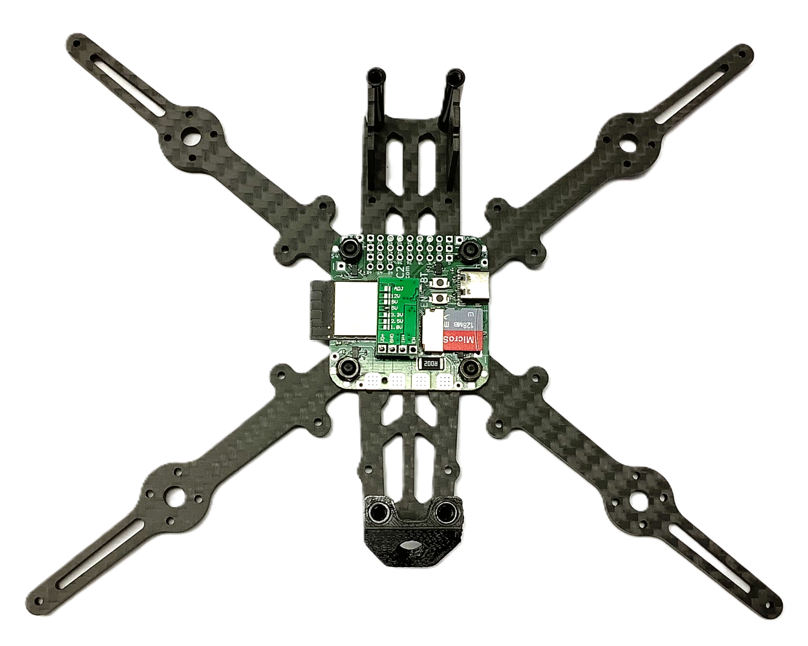
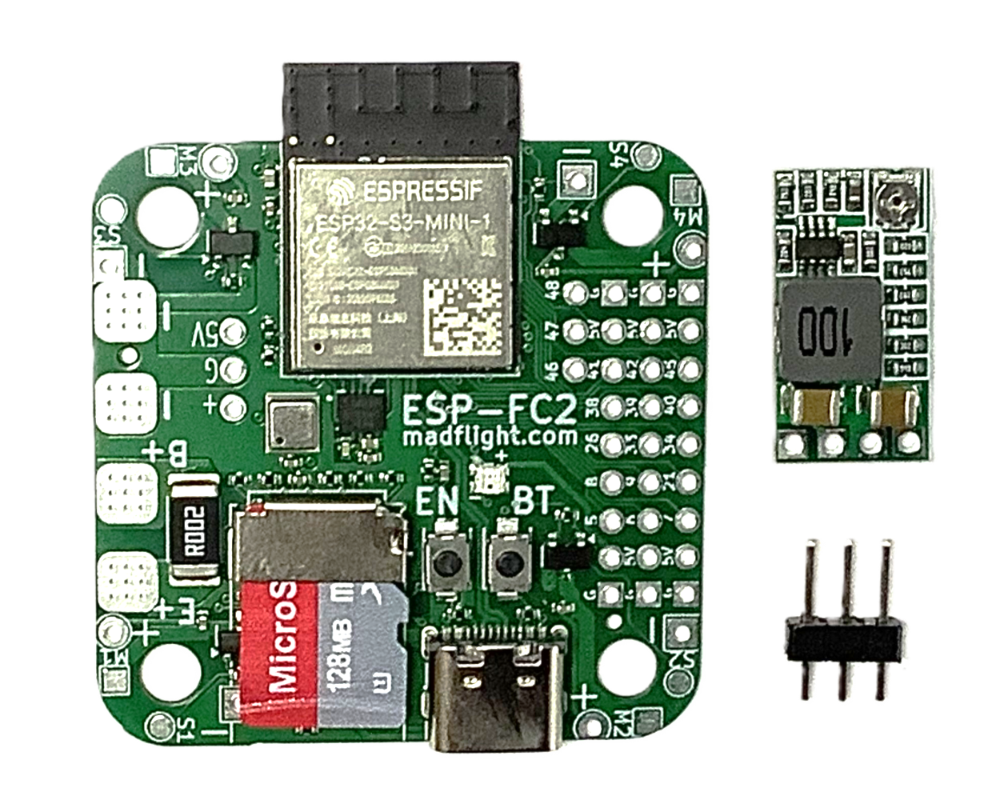

# madflight ESP-FC2 - ESP32-S3 Flight Controller

{: style="width:30%"} {: style="width:30%"} {: style="width:30%"}

[Schematic](/img/madflight-ESP-FC2.pdf)

[Buy](https://https://www.tindie.com/products/madflight/esp32-flight-controller-esp-fc2/)

This is a flight controller based on the ESP32-S3 dual core microcontroller.

Made with DIY in mind: easy accessible 2.54mm pin headers, standard mounting points to fit on quadcopter frames but can also be used for non-drone projects.

For additional flexibility: the included DC-DC board can be mounted at the top or bottom (see pictures), or can be omitted when you use an external BEC or if want to build an ultralight a 1S battery setup.

The ESP32-S3 has 3 hardware UARTs that can be connected to any of the GPIOs.

See [madflight.com](http://madflight.com/Board-ESP-FC2/) for schematic and instructions.

## Specifications

### Specifications ESP-FC2 Flight Controller

- Processor: ESP32-S3 with 4 MB flash and 2 MB psram
- Gyro/Acc: ICM-42688-P
- Magnetometer: QMC6309
- Barometer: HP203B
- Battery Monitor: INA226 with 16 bit accuracy
- Micro SDCARD with MMC interface
- RGB LED
- Operates with 1-4S LiPo/LiIon battery
- Standard M4 mounting holes with 30.5 mm spacing
- 18 GPIOs accessible via 2.54mm pin headers
- 6 GND and 6 Power pins on pin header
- 4 brushed motor drivers
- 4 ESC pins
- Reset (EN) and Boot (BT) buttons
- Dimensions: 40.5 x 40.5 x 5 mm
- Weight: 5.1 gr (without pins, DC-DC)

### Specifications DC-DC Converter

- Output: 5V 2A continous / 3A peak
- Input: 6.5~20V (for 2-4S battery)
- Dimensions: 20 x 10 x 5 mm
- Weight: 1.8 gr

## Suggested Pinouts

### Pinout for a Quadcopter

| Row | Pin 1 | Pin 2 | Pin 3 | Pin 4 | Pin 5 | Pin 6 | Pin 7 | Pin 8 | Pin 9 |
|:-:|:-:|:-:|:-:|:-:|:-:|:-:|:-:|:-:|:-:|
|Row 1|GND|+5V|Receiver RX|Receiver TX|free|free|LED Strip|GND|+5V|
|Row 2|GND|+5V|GPS RX|GPS TX|GPS SDA|GPS SCL|free|GND|+5V|
|Row 3|GND|+5V|free|free|free|free|free|GND|+5V|

Connect 4 ESCs to S1-S4, + and - pads at the corners

Or connect brushed motors to M1-M4 and the + pads at the corners

### Pinout for a Airplane

| Row | Pin 1 | Pin 2 | Pin 3 | Pin 4 | Pin 5 | Pin 6 | Pin 7 | Pin 8 | Pin 9 |
|:-:|:-:|:-:|:-:|:-:|:-:|:-:|:-:|:-:|:-:|
|Row 1|GND|+5V|Receiver RX|Receiver TX|free|free|Motor ESC|+5V|GND|
|Row 2|GND|+5V|GPS RX|GPS TX|GPS SDA|GPS SCL|Aileron Servo|+5V|GND|
|Row 3|GND|+5V|Rudder Servo|free|free|free|Elevator Servo|+5V|GND|

## Arduino IDE Setup

_madflight_ for ESP32-S3/ESP32 requires [Arduino-ESP32 v3.x.x](https://github.com/espressif/arduino-esp32)

Start the Arduino IDE and select menu Tools->Board Manager to install this software.

## PlatformIO Setup

1. Clone or download a madflight release to your harddisk

2. Start PlatformIO and open folder `madflight/extras/PlatformIO_madflight`

Note:

Espressiv stopped Arduino framework support for PlatformIO. Arduino 2 is the lastest Espressiv supported framework version, _madflight_ should still compile with Arduino 2.

If you need Arduino 3, you could try [pioarduino](https://github.com/pioarduino/platform-espressif32)

## Pinout FC1

This is the default ESP-FC2 configuration, the external pins can be reconfigured. 

Use `#define MF_BOARD "brd/madflight_ESP-FC2.h"` instead of `#define MF_BOARD "brd/default.h"` to include this pinout. 

| GPIO | External Pin Function | Internal Function |
|:-:|:-|:-|
 0 | | BT (Boot) button
 1 | S1 ESC output | 
 2 | S2 ESC output | 
 3 | S3 ESC output | 
 4 | S4 ESC output | 
 5 | free | 
 6 | free | 
 7 | free | 
 8 | free | 
 9 | free | 
10 | | I2C0_SDA (bar,bat,mag)
11 | | I2C0_SCL (bar,bat,mag)
12 | | RGBLED
13 | | IMU_INT
14 | | SPI0_MISO (imu)
15 | | SPI0_MOSI (imu)
16 | | SPI0_SCLK (imu)
17 | | IMU_CS
18 | | IMU_CLKIN
21 | free | 
26 | free | 
33 | free | 
34 | free | 
35 |  | SD_CMD (bbx)
36 |  | SD_CLK (bbx)
37 |  | SD_DAT (bbx)
38 | free | 
39 | free | 
40 | free | 
41 | free | 
42 | free | 
43 | Programmer TX | 
44 | Programmer RX | 
45 | free | 
46 | free | 
47 | free | 
48 | free | 
