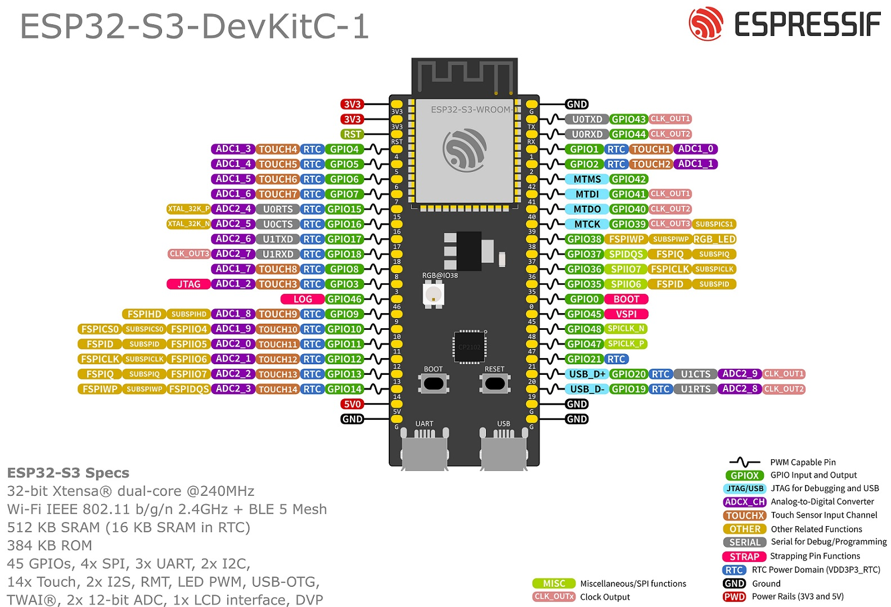

# ESP32-S3 / ESP32 Boards

## Arduino IDE Setup

_madflight_ for ESP32-S3/ESP32 requires [Arduino-ESP32 v3.x.x](https://github.com/espressif/arduino-esp32)

_madflight_ v1.1.2 and earlier requires Arduino-ESP32 v2.x.x

Start the Arduino IDE and select menu Tools->Board Manager to install this software.

## PlatformIO Setup

Clone or download the _madflight_ repository from GitHub.

Start PlatformIO, press the "Import Arduino Project" button, and import a _madflight_ example.

Adapt the platformio.ini file as follows:

```ini
; PlatformIO Project Configuration File for madflight

[env]
; Set this to the folder where madflight.h is located
; Default locations when installed via the Arduino IDE:
;    Windows: C:\Users\{username}\Documents\Arduino\libraries\madflight
;    macOS:   /Users/{username}/Documents/Arduino/libraries/madflight
;    Linux:   /home/{username}/Arduino/libraries/madflight

lib_extra_dirs = /ENTER/MADFLIGHT/FOLDER/HERE

[env:madflight_esp32]
platform = espressif32
board = esp32dev
framework = arduino
```

## Pinout ESP32-S3-DevKitC-1

This is the default pinout for ESP32-S3. It is optimized for the Espressif ESP32-S3-DevKitC-1 (44 pin) board. This pinout is defined in madflight_board__ESP32-S3.h, but can be modified with _madflight_ _pin_xxx_ configuration settings in your program.

Note: Many clones of this board exist, which use various ESP32-S3-WROOM modules and/or have different on-board hardware (LED, RGB LED, SDCARD, etc.) Set Arduino IDE Board settings and _pin_xxx_ configuration accordingly.

Note: Pin numbers refer to the GPIO numbers, not to the physical pin number on a board.

| Function | GPIO | Board | GPIO | Function |
| --: | :-- | :--: |--: | :-- |
3V3 out | 3V3 | Antenna | G | GND
3V3 out | 3V3 | | 43 | Serial USB UART port (used for programming / CLI)
reset button | RST | | 44 | Serial USB UART port (used for programming / CLI)
_pin_out0_ (connect to motor/servo1) | 4 | | 1 | free for future use
_pin_out1_ (connect to motor/servo2) | 5 | | 2 | _pin_led_ (LED not present on all boards)
_pin_out2_ (connect to motor/servo3) | 6 | | 42 | free for future use
_pin_out3_ (connect to motor/servo4) | 7 | | 41 | free for future use
_pin_out4_ (connect to motor/servo5) | 15 | | 40 | _pin_mmc_dat_ (mmc sdcard)
_pin_out5_ (connect to motor/servo6) | 16 | | 39 | _pin_mmc_clk_ (mmc sdcard)
_pin_ser1_tx_ (connect to radio rx) | 17 | | 38 | _pin_mmc_cmd_ (mmc sdcard)
_pin_ser1_rx_ (connect to radio tx) | 18 | | 37 | do not use, used for Octal PSRAM
_pin_i2c0_sda_ (connect to sda pins of sensors) | 8 | | 36 | do not use, used for Octal PSRAM
_pin_ser2_rx_ (connect to gps tx) | 3 | | 35 | do not use, used for Octal PSRAM
_pin_ser2_tx_ (connect to gps rx) | 46 | | 0 | boot button
_pin_i2c0_scl_ (connect to scl pins of sensors) | 9 | | 45| free for future use
_pin_imu_cs_ (connect to SPI gyro cs) | 10 | | 48 | RGB LED (not used)
_pin_spi0_mosi_ (connect to SPI gyro mosi) -or- _pin_i2c1_scl_ (connect to I2C gyro scl) | 11 | | 47 | free for future use
_pin_spi0_miso_ (connect to SPI gyro miso) | 12 | | 21 | free for future use
_pin_spi0_sclk_ (connect to SPI gyro sclk) -or- _pin_i2c0_sda_ (connect to I2C gyro sda) | 13 | | 20 | USB_D+ (alternate for programming / CLI)
_pin_imu_int_ (connect to SPI/I2C gyro interrupt out) | 14 | | 19 | USB_D- (alternate for programming / CLI)
5V in (*) | 5V | | G | GND
GND | G | USB connectors | G | GND

(*) 5V input via diode from BEC. Without a diode take care not connect USB and the battery at the same time!



## Setup ESP32-S3 in the Arduino IDE 

In the Aduino IDE select board: "ESP32S3 Dev Module" and set the following options in the Tools menu:

- Flash Mode: see table below
- Flash Size: see x in table below
- PSRAM: see table below

|ESP32-S3 module|Flash Mode|PSRAM|Notes
|-|-|-|-|
ESP32-S3-WROOM-1-Nx     | QIO 80MHz | - |
ESP32-S3-WROOM-1-Hx     | QIO 80MHz | - | High temperature version
ESP32-S3-WROOM-1-NxR2   | QIO 80MHz | QSPI PSRAM |
ESP32-S3-WROOM-1-NxR8   | QIO 80MHz | QSPI PSRAM | pins IO35, IO36, and IO37 are connected to the Octal SPI PSRAM and are not available
for other uses.
ESP32-S3-WROOM-1-NxR16V | QIO 80MHz | OPI PSRAM | 1.8V SPI, pins IO35, IO36, and IO37 are connected to the Octal SPI PSRAM and are not available
for other uses.
ESP32-S3-WROOM-2-NxR8V  | OPI 80MHz | OPI PSRAM | 120MHz SPI, 1.8V SPI, pins IO35, IO36, and IO37 are connected to the Octal SPI PSRAM and are not available
for other uses.

#### Setup Serial Port

Settings for 3 serial ports (Serial, Serial1 and Serial2), Serial connected to "USB-UART", Serial0 not connected (gives error 'Serial0' was not declared).

 - USB CDC On Boot: Disabled 

Settings for 4 serial ports (Serial, Serial0, Serial1 and Serial2), Serial connected to "USB-OTG", Serial0 connected to "USB-UART"

 - USB CDC On Boot: Enabled
 - USB DFU On Boot: Disabled
 - USB Mode: USB-OTG (TinyUSB)

#### Setup Programming Interface

Settings for programming via "USB-UART" usb port (programming works without pressing boot/reset buttons)

- Upload Mode: UART0 / Hardware CDC

Settings for programming via "USB-OTG" usb port (For programming: press boot, press+release reset, release boot, then upload; For serial monitor: press+release reset, then open serial monitor)

- Upload Mode: USB-OTG CDC (TinyUSB)

## Pinout ESP32 DevKitC

This is the default pinout for ESP32. It is optimized for the Espressiv ESP32 DevKitC (38 pin) board. This pinout is defined in madflight_board__ESP32.h, but can be modified with `#define HW_PIN_XXX` in your program.

Many clones of this board exist, which might have different ESP32 modules and/or different on-board hardware (LED, RGB LED, SDCARD, etc.) Set Arduino IDE Board settings and _madflight_ pin_xxx configurations accordingly.

| Function | GPIO | Board | GPIO | Function |
| --: | :-- | :--: | --: | :-- |
3V3 out      | 3V3 | Antenna side            |  GND | GND
reset button | EN |                            | 23 | _pin_i2c0_sda_ (connect to sda pins of barometer, magnetometer, etc. sensors)
_pin_spi0_miso_ (connect to SPI gyro miso) | VP 36 input only |              | 22 | _pin_i2c0_scl_ (connect to scl pins of barometer, magnetometer, etc. sensors)
_pin_imu_int_ (connect to SPI/I2C gyro interrupt out) | VN 39 input only |    | 1 TX | Serial USB UART port (used for programming / CLI)
_pin_bat_v_ (connect to battery voltage divider) | 34 input only |               | 3 RX | Serial USB UART port (used for programming / CLI)
_pin_ser1_rx_ (connect to radio tx) | 35 input only |                 | 21 | _pin_spi0_mosi_ (connect to SPI gyro mosi) -or- _pin_i2c1_scl_ (connect to I2C gyro scl) 
_pin_ser1_tx_ (connect to radio rx) | 32 |                           | GND | GND
_pin_out0_ (connect to motor/servo1) | 33 |                            | 19 | _pin_spi0_sclk_ (connect to SPI gyro sclk) -or- _pin_i2c1_sda_ (connect to I2C gyro sda) 
_pin_out1_ (connect to motor/servo2) | 25 |                            | 18 | _pin_imu_cs_ (connect to SPI gyro cs)
_pin_out2_ (connect to motor/servo3) | 26 |                       | strap 5 | _pin_ser2_tx_ (connect to gps rx)
_pin_out3_ (connect to motor/servo4) | 27 |                            | 17 | _pin_ser2_rx_ (connect to gps tx)
_pin_out4_ (connect to motor/servo5) | 14 |                            | 16 | free for future use
_pin_out5_ (connect to motor/servo6) | 12 |                             | 4 | free for future use
GND | GND |                       | boot 0 | free, not used
free for future use | 13 |                       | strap 2 | _pin_led_ (LED not present on all boards)
do not use | D2 9 flash |              | strap 15 | free for future use
do not use | D3 10 flash |           | flash 8 D1 | do not use
do not use | CMD 11 flash |          | flash 7 D0 | do not use
5V input (*) | 5V | USB connector     | flash 6 CLK | do not use

(*) 5V input via diode from BEC. Without a diode take care not connect USB and the battery at the same time!

Note: During boot the input voltage levels (pull up/pull down) on strap pins have a configuration function, therefor these pins are used as output only.

ESP32 has 6 strapping pins:
- GPIO0: internal pull-up (boot button)
- GPIO2: internal pull-down
- GPIO4: internal pull-down
- GPIO5: internal pull-up
- GPIO12: internal pull-down
- GPIO15: internal pull-up


## ESP32-S3/ESP32 Hardware

ESP32-S3 and ESP32 are very similar chips. The ESP32-S3 is more recent: it has more pins, USB-OTG (3 UARTs plus 1 USB-OTG CDC UART), improved single block RAM structure. The ESP32 is better if you need a lot of PWM channels, it has 16 PWM (LEDC) outputs, versus 8 on ESP32-S3.

#### Dual Core / FPU

ESP32 and ESP32-S3 both have dual core CPU, but single core FPU. ESP-IDF implementation limits [float usage](https://docs.espressif.com/projects/esp-idf/en/latest/esp32/api-reference/system/freertos_idf.html#floating-point-usage) to a single core, and float can not be used in interrupts. FreeRTOS is always enabled and a watchdog limits interrupt execution time.

madflight uses float and is therefor limited to single core operation. The IMU loop runs as a high priorty task, triggered by the IMU interrupt.
