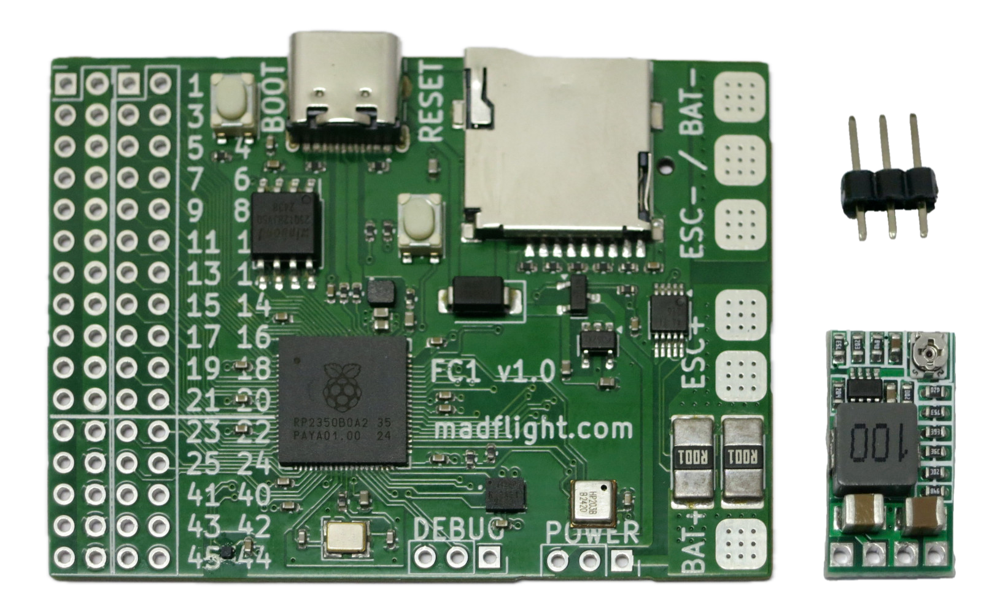
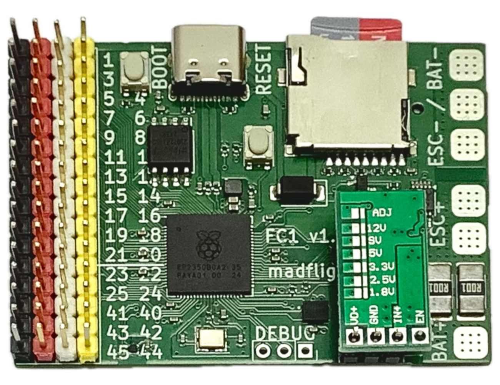

# madflight FC1 - RP2350B Flight Controller

{: style="width:52.8%"} {: style="width:42.1%"}

[Schematic](/img/madflight-FC1.pdf)

[Buy](https://www.tindie.com/products/madflight/flight-controller-raspberry-pi-rp2350b/)

## Specifications

#### madflight FC1

- MCU: RP2350B with 48 GPIO, 32 GPIO accessible via pinheader
- Gyro/Acc: ICM-42688-P
- Magnetometer: QMC6309
- Barometer: HP203B
- Batery Monitor: INA226
- Black Box: MicroSD (1-bit SPI or 4-bit SDIO)
- PSRAM: Optional (empty SO-8 socket on back of board)
- Dimensions: 57.6 x 42 mm
- Weight: 7.5 gr (without pins, DC-DC)

#### Optional DC-DC Converter

- Output: 5V 2A continous / 3A peak
- input: 6.5~20V
- Dimensions: 20 x 10 x 5 mm
- Weight: 1.8 gr

## Arduino IDE and PlatformIO Setup

See [here](Board-RP2040.md)

## Betaflight Setup

See [here](Board-FC3.md)

## Pinout FC1

Set `#define MF_BOARD "brd/madflight_FC1.h"` to use this configuration, it can be modified with `madflight_config` configuration settings in your program.

| GPIO | External Pin Function | Internal Function |
|:-:|:-|:-|
 0 | SER0_TX (connect to radio receiver RX) | 
 1 | SER0_RX (connect to radio receiver TX) | 
 2 | I2C1_SDA (connect to GPS SDA) | 
 3 | I2C1_SCL (connect to GPS SCL) | 
 4 | SER1_TX (connect to GPS RX) | 
 5 | SER1_RX (connect to GPS TX) | 
 6 | free | 
 7 | OUT0 (connect to ESC for motor 1) | 
 8 | free | 
 9 | OUT1 (connect to ESC for motor 2) | 
10 | free | 
11 | OUT2 (connect to ESC for motor 3) | 
12 | free | 
13 | OUT3 (connect to ESC for motor 4) | 
14 | free | 
15 | OUT4 | 
16 | free | 
17 | OUT5 | 
18 | free | 
19 | OUT6 | 
20 | free | 
21 | OUT7 | 
22 | free | 
23 | free | 
24 | free | 
25 | free | 
26 |  | MAG_INT
27 |  | IMU_INT
28 |  | SPI1_MISO (imu)
29 |  | IMU_CS
30 |  | SPI1_SCLK (imu)
31 |  | SPI1_MOSI (imu)
32 |  | I2C0_SDA (bar,bat,mag)
33 |  | I2C0_SCL (bar,bat,mag)
34 |  | SDIO_CLK/SPI0_SLCK (bbx)
35 |  | SDIO_CMD/SPI0_MOSI (bbx)
36 |  | SDIO_D0/SPI0_MISO (bbx)
37 |  | SDIO_D1 (bbx)
38 |  | SDIO_D2 (bbx)
39 |  | SDIO_D3/SPI0_CS (bbx)
40 | free (ADC) | 
41 | free (ADC) | 
42 | free (ADC) | 
43 | free (ADC) | 
44 | free (ADC) | 
45 | free (ADC) | 
46 |  | BAR_INT
47 |  | QMI_CS1 (for optional PSRAM)

## RP2350B Hardware

RP2350B is the 80 pin / 48 gpio variant of the Raspberry Pi RP2350 processor.

RP2350 has dual core processor, plus dual single precision FPUs.

_madflight_ uses float and is much happier with RP2350 than with RP2040 !

_madflight_ uses a custom Serial library, because the default Arduino Serial transmitter blocks after sending a couple bytes. Something we don't want.

_madflight_ uses FreeRTOS and executes the 1000Hz IMU loop on the second core. The first core is used for the other sensors.

## madflight Limitiations

- OUT: Consecutive even/odd PWM pins (e.g. pins 2,3 or 10,11) share the same timer and have the same frequency.
