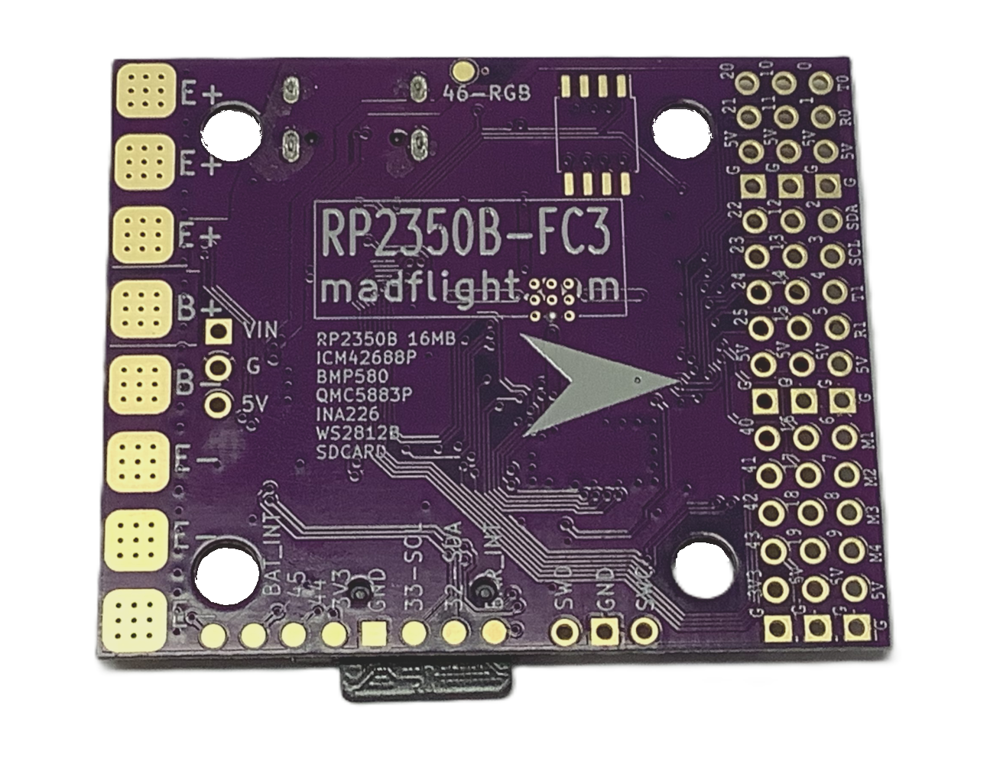
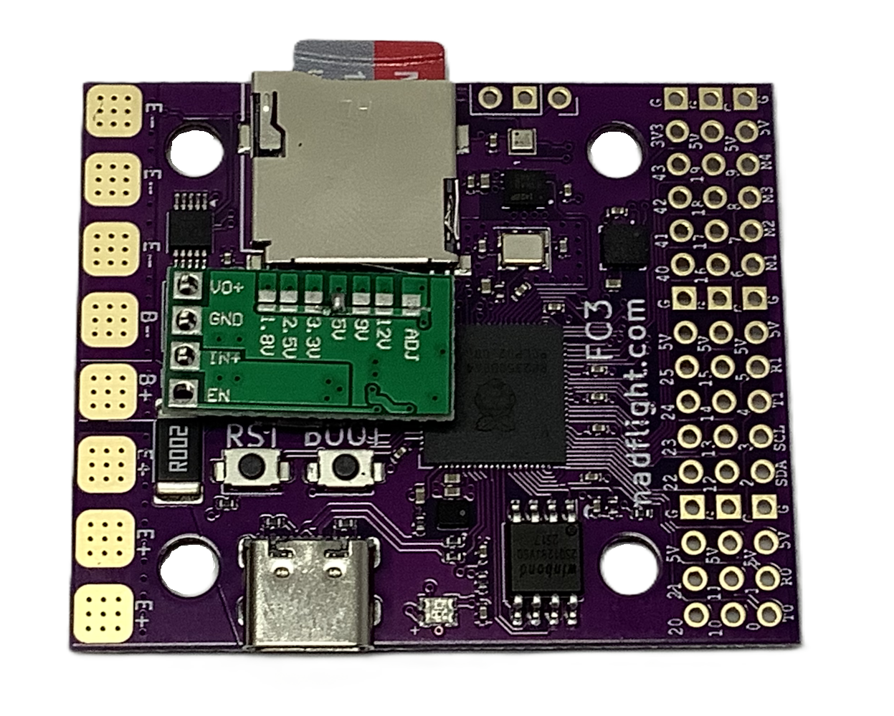

# madflight FC3 - RP2350B Flight Controller

{: style="width:27.97%"} {: style="width:21.54%"}  {: style="width:20.53%"}  {: style="width:21.95%"}

[Schematic](/img/madflight-FC3v2.pdf)

[Buy](https://www.tindie.com/products/madflight/flight-controller-raspberry-pi-rp2350b/)

This is a Raspberry Pi Pico2 on steroids. Use it as a flight controller, or for a project that requires precise orientation sensing with the on-board 10DOF best-in-class sensors. 

The layout of the pins is similar to the Raspberry Pi Pico2, but with added 5V power pins to make it easy to connect external components like RC receivers, GPS with compass, 4-in-1 ESC, Servos, Radars, etc. 

Easy mounting: Use the standard 30.5mm x 30.5mm mounting holes to fit your drone frame. Or use double sided tape to mount the board, the board has no components on the back.

Power the board directly from 3 ~ 6V (eg. USB or 1S LiPo), or use the included DC-DC converter to connect larger batteries. For added flexibility the DC-DC converter board can be top or bottom mounted.

Even when using all interal functions, the external pins can be used for:

- 22 PWM pins
- 8 DSHOT pins
- 6 Serial Ports (2 Hardware + 4 PIO UARTs)
- 1 I2C Port
- 1 SPI Port
- 6 ADC pins

## Specifications

#### madflight FC3

- RP2350B with 48 GPIO
- 16MB Flash
- 30 pins accessible via 2.54mm pinheader
- 9 power and 9 ground pins
- Gyro/Acc: ICM-45686 Precision Gyro/Accelerometer
- MMC5603 Magnetometer
- BMP580 Precision Barometer (2cm noise @ 85Hz sample rate)
- INA226 16-bit Battery Monitor (36V, 40A with 1.25mV, 1.25mA resolution)
- WS2812B RGB LED
- SDCARD with click mechanism and fast 4-bit SDIO interface
- Optional PSRAM or second Flash (empty SO-8 socket on back of board)
- Standard 30.5 x 30.5 mm mounting with 4x Φ4mm holes, with grommets Φ3mm
- Dimensions: 50.7 x 41.6 mm (4.2 mm max height)
- Weight: 5.6 gr (without DC-DC)

#### DC-DC Converter (included)

- Output: 5V 2A continous / 3A peak
- Input: 6.5 ~ 20V
- Dimensions: 20 x 10 x 5 mm
- Weight: 1.8 gr

## Arduino IDE Setup

_madflight_ for RP2350/RP2040 requires [arduino-pico v4.x.x or later](https://github.com/earlephilhower/arduino-pico) (Note: for fast SDIO SDCARD arduino-pico v5.x.x is required.)

Start the Arduino IDE and select menu **Tools->Board Manager** to install arduino-pico.

Set menu **Tools->Operating System** to "FreeRTOS SMP"

For programming, select board "Solder Party RP2350 Stamp XL"

## PlatformIO Setup

1. Clone or download a madflight release to your harddisk

2. Start PlatformIO and open folder `madflight/examples`

3. Compile env:RP2350B

Note: RP2040/RP2350 is not merged into mainline PlatformIO, see [here](https://arduino-pico.readthedocs.io/en/latest/platformio.html). On Windows you need to enable long path names, see previous link for instructions.

To enable uploading on Windows you need to use [Zadig](https://zadig.akeo.ie/) - Connect a RP2 device whist holding the boot button, then in Zadig select "RP2 Boot (Interface 1) and install the WinUSB driver. See [here](https://community.platformio.org/t/cannot-upload-to-raspberry-pi-pico/45936/2)

## Betaflight Setup

Betaflight firmware runs on the FC3 and FC1 flight controllers. 

Latest pre-compiled Betaflight firmware for FC3 is here: 

https://github.com/qqqlab/bf-config/raw/refs/heads/uf2/betaflight_2025.12.0-beta_RP2350B_MADFLIGHT_FC3.uf2

Not all Betaflight features are supported yet for RP2350 as it is a new target for Betaflight, but:

- IMU works
- DSHOT600 works (but not PWM, see https://github.com/betaflight/betaflight/issues/14743 )
- SDCARD works
- External BMP280/DPS310 barometer works
- 4 UARTs work
- CRSF/ELRS receiver works
- RGB LED works

Open https://app.betaflight.com with a Chrome browser to configure your FC3. (The PC Configurator is history.)

Latest config.h for Betaflight is here: https://github.com/betaflight/config/pull/940

## Pinout FC3v2

Set `#define MF_BOARD "brd/madflight_FC3v2.h"` to use this configuration, it can be modified with `madflight_config` configuration settings in your program.

| GPIO |Default External Pin Function | Internal Function |
|:-:|:-|:-|
 0 | SER0_TX (connect to radio receiver RX) | 
 1 | SER0_RX (connect to radio receiver TX) | 
 2 | I2C1_SDA (connect to GPS SDA) | 
 3 | I2C1_SCL (connect to GPS SCL) | 
 4 | SER1_TX (connect to GPS RX) | 
 5 | SER1_RX (connect to GPS TX) | 
 6 | OUT0 (connect to ESC for motor 1) | 
 7 | OUT1 (connect to ESC for motor 2) | 
 8 | OUT2 (connect to ESC for motor 3) | 
 9 | OUT3 (connect to ESC for motor 4) | 
10 | free | 
11 | free | 
12 | free | 
14 | free | 
15 | free | 
16 | free | 
17 | free | 
18 | free | 
19 | free | 
20 | free | 
21 | free | 
22 | free | 
23 | free | 
24 | free | 
25 | free | 
26 |  | IMU_CLKIN
27 |  | IMU_INT
28 |  | IMU_SPI1_MISO
29 |  | IMU_CS
30 |  | IMU_SPI1_SCLK
31 |  | IMU_SPI1_MOSI
32 |  | I2C0_SDA (bar,bat,mag)
33 |  | I2C0_SCL (bar,bat,mag)
34 |  | SD_SDIO_CLK or SD_SPI0_SLCK
35 |  | SD_SDIO_CMD or SD_SPI0_MOSI
36 |  | SD_SDIO_D0 or SD_SPI0_MISO
37 |  | SD_SDIO_D1
38 |  | SD_SDIO_D2
39 |  | SD_SDIO_D3 or SD_SPI0_CS
40 | free (ADC0) | 
41 | free (ADC1) | 
42 | free (ADC2) | 
43 | free (ADC3) | 
44 |  | 100k/10k Vbat voltage divider
45 |  | Blue LED
46 |  | RBG LED
47 |  | QMI_CS1 (for optional PSRAM)

SMD Pads

- GPIO 33 (internal SDA)
- GPIO 32 (internal SCL)
- GPIO 46 (internal RGB LED)
- BAT_INT Battery sensor interrupt pin

## RP2350B Hardware

RP2350B is the 80 pin / 48 GPIO variant of the Raspberry Pi RP2350 processor.

RP2350 has dual core processors with dual single precision FPUs.

_madflight_ uses a custom Serial library, because the default Arduino Serial transmitter blocks after sending a couple bytes. Something we don't want.

_madflight_ uses FreeRTOS and executes the IMU loop on the second core. The first core is used for the other sensors.

## madflight Limitiations

- OUT: Consecutive even/odd PWM pins (e.g. pins 2,3 or 10,11) share the same timer and have the same frequency.

## Previous Versions of this Board

[madflight FC3v1](Board-FC3v1.md)
[madflight FC1](Board-FC1.md)
