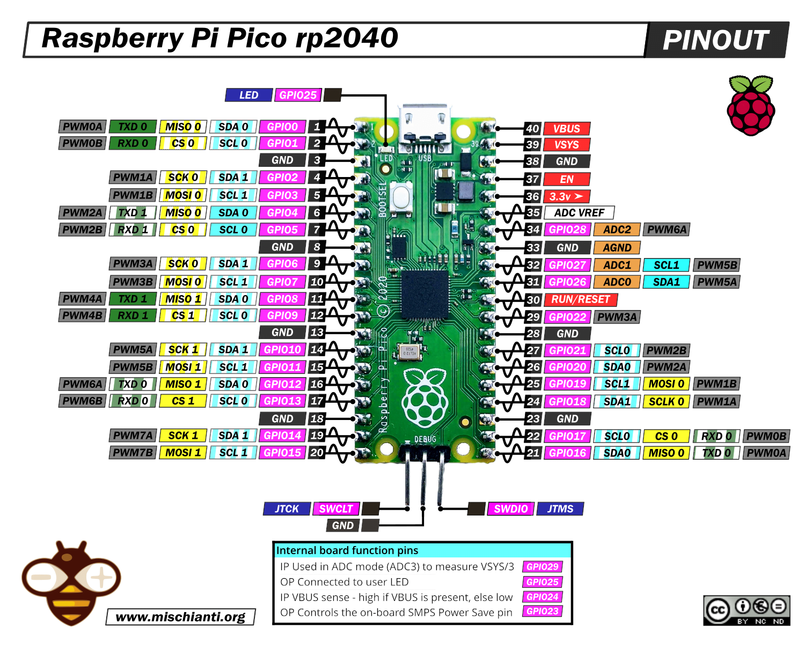
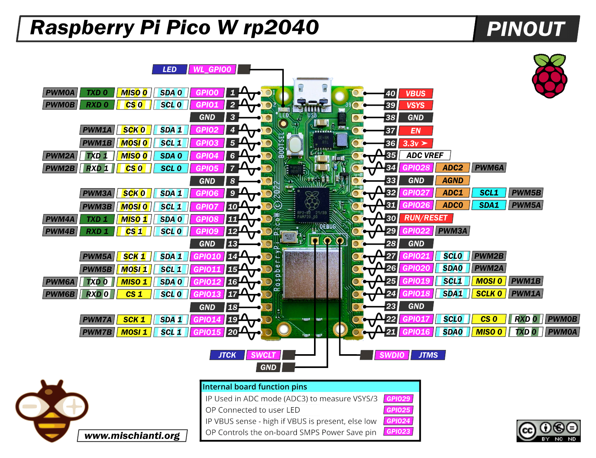

# RP2040 / RP2350 Boards

## Arduino IDE Setup

_madflight_ for RP2350/RP2040 requires [arduino-pico v4.x.x or later](https://github.com/earlephilhower/arduino-pico) (Note: for fast SDIO SDCARD arduino-pico v5.x.x is required.)

Start the Arduino IDE and select menu **Tools->Board Manager** to install this software.

Install the _madflight_ library: use menu **Tools->Manage Libraries**, then search for _madflight_

Open a _madflight_ example: use menu **File->Examples->Examples for custom libraries->madflight->00.HelloWorld.ino**

To compile an example use the following settings:

  - Set menu **Tools->Operating System** to "FreeRTOS SMP"
  - Set menu **Tools->USB Stack** to "Pico SDK"

## PlatformIO Setup

1. Clone or download a madflight release to your harddisk

2. Start PlatformIO and open the madflight root folder

3. Open file platformio.ini and adapt the settings

4. Compile env:RP2040, env:RP2350A, or env:RP2350B

Note: RP2040/RP2350 is not merged into mainline PlatformIO, see [here](https://arduino-pico.readthedocs.io/en/latest/platformio.html). On Windows you need to enable long path names, see previous link for instructions.

To enable uploading on Windows you need to use [Zadig](https://zadig.akeo.ie/) - Connect a RP2 device whilst holding the boot button, then in Zadig select "RP2 Boot (Interface 1) and install the WinUSB driver. See [here](https://community.platformio.org/t/cannot-upload-to-raspberry-pi-pico/45936/2)

## Pinout Raspberry Pi Pico / Pico2

This is the default pinout for RP2040 and RP2350. It is optimized for Raspberry Pi Pico / Pico2 (40 pin) boards. This pinout is defined`brd/default_RP2040.h`, but can be modified with `madflight_config` configuration settings in your program.

| Module <-> HW_PIN_xxx | GPIO | Board | GPIO | HW_PIN_xxx <-> Module |
| --: | :-- | :--: | --: | :-- |
_pin_ser0_tx_ (connect to radio rx)      | 0   | USB connector |     VBUS | not connected
_pin_ser0_rx_ (connect to radio tx)      | 1   |               |     VSYS | 5V input via diode (*)
GND                                      | GND |               |      GND | GND
_pin_out0_ (connect to motor/servo1)     | 2   |               |       EN | not connected
_pin_out1_ (connect to motor/servo2)     | 3   |               | 3.3V out | 3V3
_pin_out2_ (connect to motor/servo3)     | 4   |               |     VREF | not connected
_pin_out3_ (connect to motor/servo4)     | 5   |               |  (A2) 28 | _pin_bat_v_ (connect to battery voltage divider)
GND                                      | GND |               |      GND | GND
_pin_out4_ (connect to motor/servo5)     | 6   |               |  (A1) 27 | _pin_bat_i_ (connect to battery current sensor)
_pin_out5_ (connect to motor/servo6)     | 7   |               |  (A0) 26 | free for future use
_pin_ser1_tx_ (connect to gps rx)        | 8   |               |      RUN | reset button to GND
_pin_ser1_rx_ (connect to gps tx)        | 9   |               |       22 | _pin_imu_int_ (connect to SPI/I2C gyro interrupt out)
GND                                      | GND |               |      GND | GND
_pin_i2c1_sda_ (connect to I2C gyro sda) | 10  |               |       21 | _pin_i2c0_scl_ (connect to scl pins of barometer, magnetometer, etc.)
_pin_i2c1_scl_ (connect to I2C gyro scl) | 11  |               |       20 | _pin_i2c0_sda_ (connect to sda pins of barometer, magnetometer, etc.)
_pin_spi1_miso_ (connect to sdcard miso) | 12  |               |       19 | _pin_spi0_mosi_ (connect to SPI gyro mosi) 
_pin_bbx_cs _ (connect to sdcard cs)     | 13  |               |       18 |  _pin_spi0_sclk_ (connect to SPI gyro sclk)
GND                                      | GND |               |      GND | GND
_pin_spi1_sclk_ (connect to sdcard sclk) | 14  |               |       17 | _pin_imu_cs_ (connect to SPI gyro cs)
_pin_spi1_mosi_ (connect to sdcard mosi) | 15  |   JTAG pins   |       16 | _pin_spi0_miso_ (connect to SPI gyro miso)

Internally connected: _pin_led_ GPIO25

(*) 5V input via diode from BEC or DC-DC converter. Without a diode take care not connect USB and the battery at the same time!

## RP2040/RP2350 Hardware

RP2350 (Raspberry Pi Pico2) is newer and a lot more powerful than RP2040 (Raspberry Pi Pico).

RP2350 has dual core processor, plus dual single precision FPUs.

RP2040 has dual core processor, but no FPUs.

_madflight_ uses float and is much happier with RP2350 than with RP2040 !

_madflight_ uses a custom Serial library, because the default Arduino Serial transmitter blocks after sending a couple bytes. Something we don't want.

_madflight_ uses FreeRTOS and executes the 1000Hz IMU loop on the second core. The first core is used for the other sensors.

## madflight Limitiations

- OUT: Consecutive even/odd PWM pins (e.g. pins 2,3 or 10,11) share the same timer and have the same frequency.
