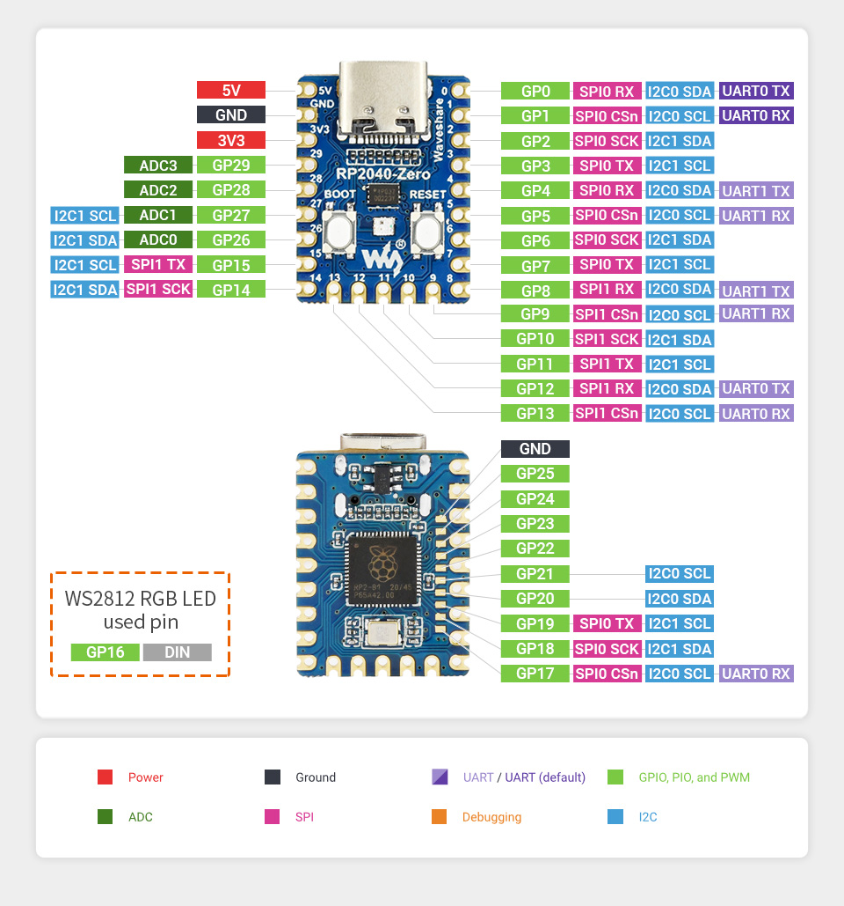

# RP2350 / RP2040 Boards

madflight for RP2350/RP2040 requires [arduino-pico v4.x.x](https://github.com/earlephilhower/arduino-pico)

Start the Arduino IDE and select menu Tools->Board Manager to install this software.

## Pinout Raspberry Pi Pico2 / Raspberry Pi Pico 

This is the default pinout for RP2350 and RP2040. It is optimized for Raspberry Pi Pico2 / Raspberry Pi Pico (40 pin) boards. This pinout is defined in madflight_board_default_RP2040.h, but can be modified with `#define HW_PIN_XXX` in your program.

| Function | GPIO | Board | GPIO | Function |
| --: | :-- | :--: | --: | :-- |
|      RCIN_TX | 0   | USB connector | VBUS     | nc
|      RCIN_RX | 1   |               | VSYS     | 5V input via diode (*)
|          GND | GND |               | GND      | GND
|         PWM1 | 2   |               | EN       | nc
|         PWM2 | 3   |               | 3.3V out | 3V3
|         PWM3 | 4   |               | VREF     | nc
|         PWM4 | 5   |               | 28_A2    | BAT_V
|          GND | GND |               | GND      | GND
|         PWM5 | 6   |               | 27_A1    | -
|         PWM6 | 7   |               | 26_A0    | -
|       GPS_TX | 8   |               | RUN      | reset button to GND
|       GPS_RX | 9   |               | 22       | IMU_EXTI
|          GND | GND |               | GND      | GND
|         PWM7 | 10  |               | 21       | I2C_SCL
|         PWM8 | 11  |               | 20       | I2C_SDA
|  SD_SPI_MISO | 12  |               | 19       | SPI_MOSI
|    SD_SPI_CS | 13  |               | 18       | SPI_SCLK
|          GND | GND |               | GND      | GND
|  SD_SPI_SCLK | 14  |               | 17       | IMU_CS
|  SD_SPI_MOSI | 15  | JTAG pins     | 16       | SPI_MISO

(*) 5V input via diode from BEC. Without a diode take care not connect USB and the battery at the same time!

## Pinout RP2040-Zero

This pinout is optimized for the RP2040-Zero (21 pin) board. This pinout is defined in madflight_board_RP2040-Zero.h, but can be modified with `#define HW_PIN_XXX` in your program.

| Function | GPIO | Board | GPIO | Function |
| --: | :-- | :--: | --: | :-- |
| 5V input (*) | 5V  | USB connector | 0 | RCIN_TX
|          GND | GND |               | 1  | RCIN_RX
|      3V3 out | 3V3 |               | 2  | PWM1
|            - | 29  |               | 3  | PWM2
|        BAT_V | 28  |               | 4  | PWM3
|     I2C1_SCL | 27  |               | 5  | PWM4
|     I2C1_SDA | 26  |               | 6  | PWM5
|     IMU_EXTI | 15  |               | 7  | PWM6
|              | 14  |               | 8  | GPS_TX
|              |     |               |    | 
|              |     |               | 9  | GPS_RX
|              |     |               | 10 | SPI1_SCLK
|              |     |               | 11 | SPI1_MISO
|              |     |               | 12 | SPI1_MOSI
|              |     |               | 13 | IMU_CS

(*) 5V input via diode from BEC. Without a diode take care not connect USB and the battery at the same time!

## RP2350/RP2040 Hardware

RP2350 (Raspberry Pi Pico2) is newer and a lot more powerful than RP2040 (Raspberry Pi Pico).

#### Dual Core / FPU

RP2350 has dual core, dual single precision FPU.

RP2040 has dual core, no FPU.

madflight uses float and is much happier with RP2350 than with RP2040 !

#### FreeRTOS

FreeRTOS is optional.

#### PWM

Consecutive even/odd PWM pins (e.g. pins 2,3 or 10,11) share the same timer and have the same frequency.

#### Serial

madflight uses a custom high performance SerialIRQ library.

#### madflight for RP2040

madflight for RP2040 uses FreeRTOS and executes the 1000Hz IMU loop on the second core, which is 80% loaded at default 133MHz CPU speed. You can overclock the CPU to get some more headroom.

#### madflight for RP2350
