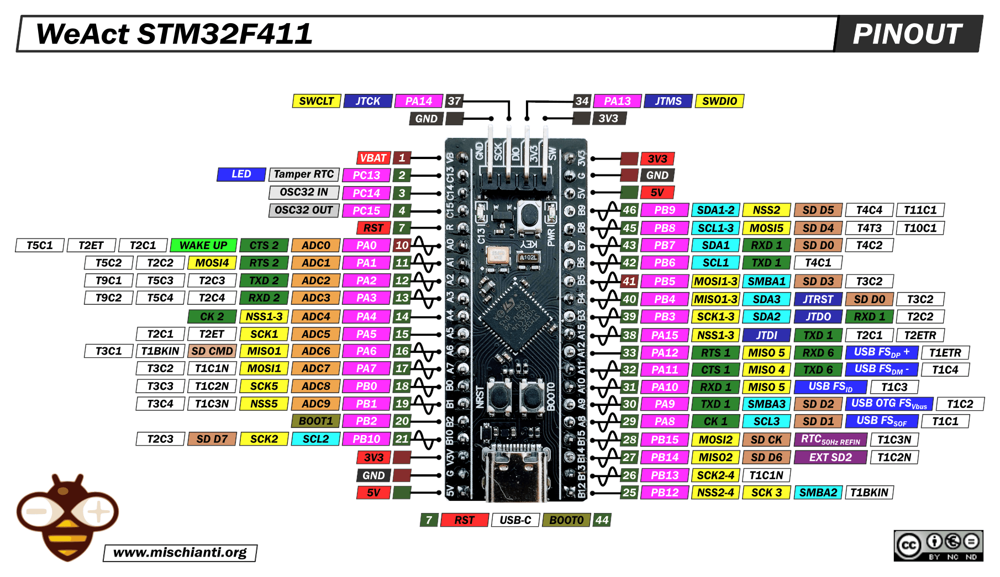

# STM32 Boards

madflight for STM32 requires:

- [STM32duino Arduino Core for STM32 v2.x.x](https://github.com/stm32duino/Arduino_Core_STM32) Start the Arduino IDE and select menu Tools->Board Manager to install this software.

- [STM32duino FreeRTOS](https://github.com/stm32duino/STM32FreeRTOS) Select menu Tools->Manage Libaries, then search for "STM32duino FreeRTOS".

## Pinout STM32 Of-the-shelf Flight Controllers

In the `src` directory you'll find 400+ Betaflight configuration files for commercial flight controllers. Include the madflight_board_betaflight_XXX.h header file of your board, and in your program set '#define HW_USE_XXX' to match your board. 

## Pinout STM32F411 Black Pill

This is the default pinout for STM32. It is optimized for the WeAct STM32F411 Black Pill (40 pin) board. This pinout is defined in madflight_board_default_STM32.h, but can be modified with `#define HW_PIN_XXX` in your program.

| Function | GPIO | Board | GPIO | Function |
| --: | :-- | :--: | --: | :-- |
|           nc | VB  |   SWD pins    | 3V3 | 3V3 out
|          LED | C13 |               | G   | GND
|            - | C14 |               | 5V  | 5V input (*)
|            - | C15 |               | B9  | PWM10(t4)
|           nc | R   |               | B8  | PWM9(t4)
|            - | A0  |               | B7  | I2C_SCL
|            - | A1  |               | B6  | I2C_SDA
|       GPS_TX | A2  |               | B5  | PWM8(t3)
|       GPS_RX | A3  |               | B4  | PWM7(t3)
|       IMU_CS | A4  |               | B3  | RCIN_RX
|     SPI_SCLK | A5  |               | A15 | RCIN_TX
|     SPI_MISO | A6  |               | A12 | USB_DP
|     SPI_MOSI | A7  |               | A11 | USB_DN
|        BAT_I | B0  |               | A10 | PWM6(t1)
|        BAT_V | B1  |               | A9  | PWM5(t1)
|            - | B2  |               | A8  | PWM4(t1)
|     IMU_EXTI | B10 |               | B15 | PWM3(t1)
|      3V3 out | 3V3 |               | B14 | PWM2(t1)
|          GND | G   |               | B13 | PWM1(t1)
| 5V input (*) | 5V  | USB connector | B12 | -

Internally connected: C13 - LED, A0 - key button

PWM1-6 are connected to timer1, PWM7-8 to timer3 and PWM9-10 to timer4. PWM pins connected to the same timer operate at the same frequency.

(*) 5V input via diode from BEC. Without a diode take care not connect USB and the battery at the same time!

## STM32 Hardware

The STM32 MCU family is a huge collection of chips. Madflight will run on most stm32duino supported F4, F7, H7 and similar chips, preferred are STM32H743 and STM32F405.

#### Dual Core / FPU

Most supported STM32 targets have a single core MCU with FPU. 

#### FreeRTOS

FreeRTOS is optional.

#### madflight for STM32

madflight for STM32 runs the IMU loop in interrupt context.
