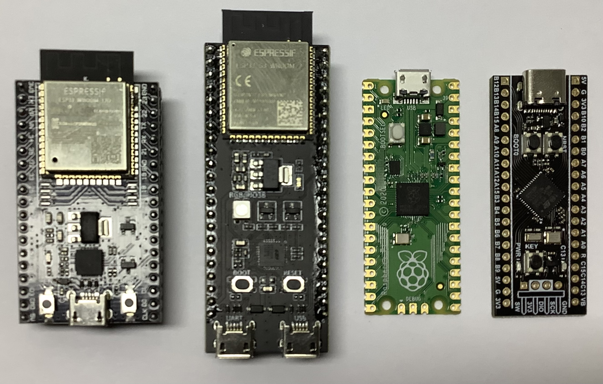
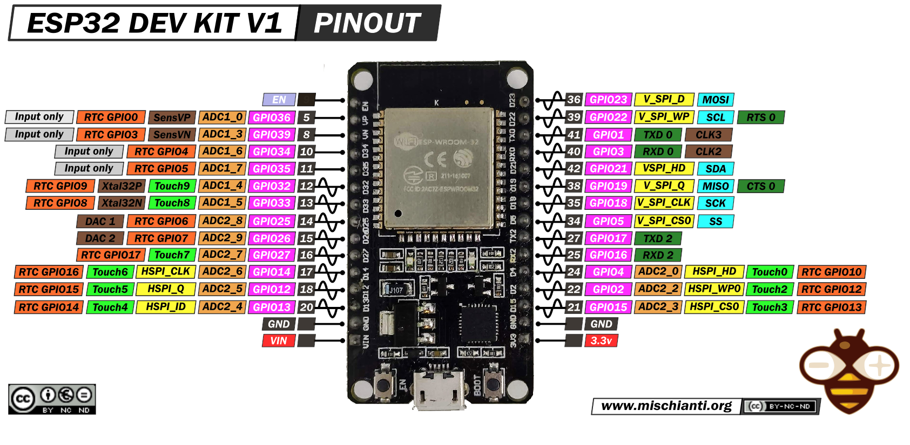
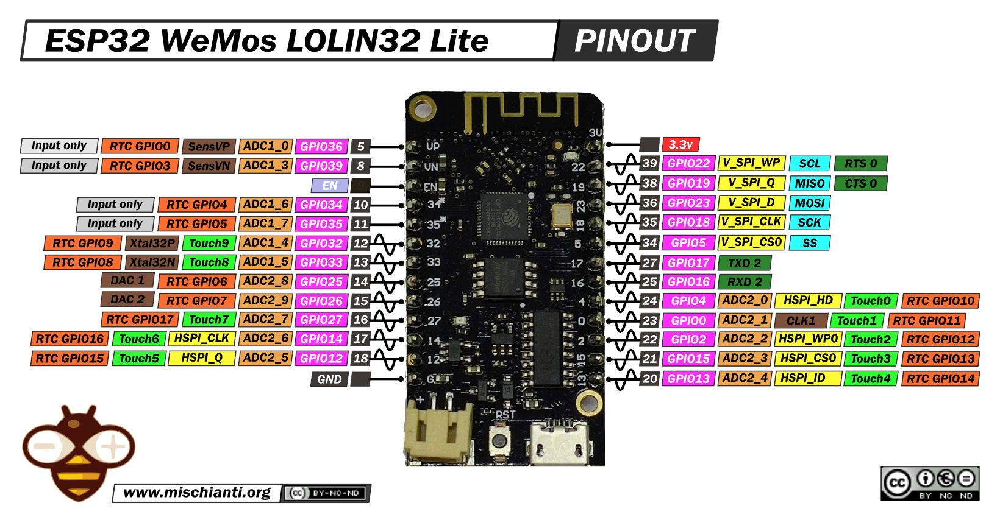
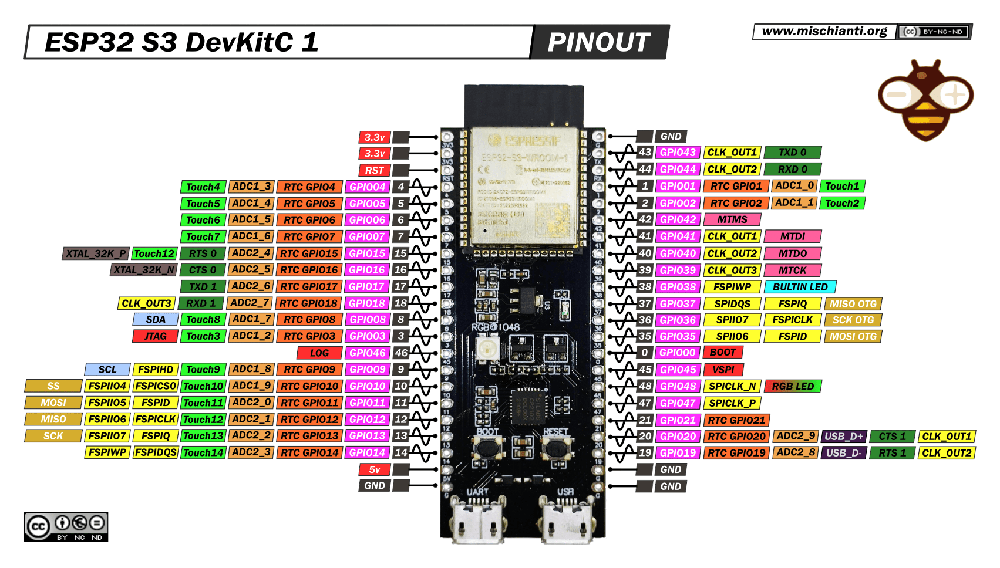

# Controller Boards

## Minimum Controller Requirements

- Arduino support
- 32 bit processor
- At least 21 GPIO pins for:
  - 3x UART: Receiver, GPS, spare/debug (6 pins)
  - 1x SPI: fast IMU (4 pins)
  - 1x I2C: Magnetometer, Barometer, Current sensor, slow IMU (2 pins)
  - 1x IMU interrupt pin
  - 8x PWM: Motor, Servo (8 pins)
  
## Default madflight Controller Boards

| Board | ESP32 DevKitC | ESP32-S3 DevKitC | Raspberry Pi Pico (W) | Raspberry Pi Pico 2 | Black Pill |
| --- | :-: | :-: | :-: | :-: | :-: |
Board Size | 55 * 28 mm | 69 * 26 mm | 51 * 21 mm | 51 * 21 mm | 53 * 21 mm
Board Weight | 6.9 g (9.1 g with headers) | 8.4 g (10.9 g with headers) | 3.0 g | 3.0 g | 4.5 g
Board Pins | 38 pins | 44 pins | 40 pins | 40 pins | 40 pins
Available external GPIO pins | 21 GPIOs + 4 input only + 1 button: 0 Note: strap pin restrictions | 25 GPIOs + 7 external pins but used: Button: 0 OSPI: 35, 36, 37 RGB LED: 38 USB: 19, 20 Note: strap pin restrictions | 26 GPIOs Internal only: Power save: 23 VBUS monitor: 24 LED: 25 VSYS voltage: 29 ADC3 | 26 GPIOs Internal only: Power save: 23 VBUS monitor: 24 LED: 25 VSYS voltage: 29 ADC3 | 30 GPIOs + 2 external but used: Button: PA0 LED: PC13
PWM | 16 (8 LEDC timers each with 2 output pins) | 8 (4 LEDC timers each with 2 output pins) | 16 (8 timers each with 2 output pins) | 24 | 25 (6 * 16bit + 2 * 32bit timers)
Available UART | 3 | 3 | 6 (2 + 4*PIO) +USB Serial debug | 8 (2 + 6*PIO) +USB Serial debug | 3
Available SPI | 2 | 2 | 2 | 2 | 5
Available I2C | 2 | 2 | 2 | 2 | 2
Available ADC pins | 16 (12bit) | 20 (12bit) | 3 (12bit) | 3 (12bit) | 10 (12bit)
On Board Peripherals | WIFI + BT + Button | WIFI + BT + Button + RGB LED | LED + WIFI/BT (W) | LED | Button + LED (+ optional SPI flash)
MCU | ESP32 | ESP32S3 | RP2040 | RP2350 | STM32F411CE/CC
MCU GPIO | 34 | 45 | 30 | 30 | 32
Processor | 2 core LX6 240MHz | 2 core LX7 240MHz | 2 core M0+ 200MHz (overclock 266MHz) | 2 core M33 150MHz (overclock 300MHz) | 1 core M4 100MHz
Coremark (single core) | 351 | | 228 | | 172
FPU | 1 core FPU | 1 core FPU | no FPU | 2 core FPU | 1 core FPU
MFLOPS (*) | 63 | 61 | 2.0 | 78 (156 overclock) | 48
RAM | 320K data 132K instruction 64K cache | 320K data 128K instruction 64K cache | 264K data/instr. 16K XIP cache | 520K | 128K
Flash | 2-16M QuadSPI | 2-16M OctalSPI | 2M QuadSPI | 4M QuadSPI | 512K internal (CE) 256K internal (CC)
PSRAM | 0-8M | 0-8M | 0 | 0 | 0
Board price single piece | $4 | $5 | $4 | $5 | $3

(*) MFLOPS (million floating point operations per second) results with TestFLOPS program in tools folder

## Other Boards

|Board|MCU|Specs|IO|Size|Weight|Power Consumption|Price|
|-|-|-|-|-|-|-|-|
WeAct RP2350B | RP2350B | 16MB flash, RESET+BOOT+KEY button, LED | 48 io | 41 * 41 mm | 6.8 gr | | $5
Waveshare RP2040-Zero | RP2040 | 2MB flash, RESET+BOOT button, RGB LED | 20 io + 9 via solder points | 23 * 17 mm | 1.7 gr | | $3
WeMos LOLIN32-Lite | ESP32 | 4MB flash, 0MB PSRAM, 2*240MHz, RESET button, lipo charger, LED | 23 io | 50 * 25 mm | 4.7 gr | | $3
WeMos LOLIN S3 Mini | ESP32-S3 | 4MB flash, 2MB PSRAM, 2*240MHz, RESET+BOOT button, LED | 27 io | 34 * 25 mm | 3 gr | | $5
WeAct STM32F405 Core Board | STM32F405RGT6 | 1MB flash, 192kB RAM, 1*168MHz, 6 UART, RESET+BOOT+USER button, LED, SDCARD | 45 io | 42 * 25 mm | | | $8
WeAct STM32H743 Core Board | STM32H743VIT6 | 2MB flash, 1MB RAM, 1*480MHz, 8 UART, RESET+BOOT+USER button, LED, SDCARD, 8MB SPI Flash, LCD, DVP | 77 io | 67 * 41 mm | 13.7 gr | 0.5W | $16
Raspberry Pi Zero | ARM11 | SDCARD, 512MB RAM, 1*1GHz, in production until at least jan 2030 | 26 io | 65 * 30 mm | 9.0 gr | 0.4W (idle) to 1.0W (100% cpu) | $9 + SDCARD
Raspberry Pi Zero 2 W | Arm Cortex-A53 | SDCARD, 512MB RAM, 4*1GHz, WLAN, in production until at least jan 2030 | 26 io | 65 * 30 mm | 11.4 gr | 0.8W to 3.0W (idle=0.8W + 0.55W per 100% core) | $15 + SDCARD

## STM32 Flight Controllers

A list of STM32 microcontrollers used in commercial flight controllers, in order of processing power, from least to most:

| MCU | Clock | Flash | RAM | Flight Controller Firmware | Breakout Board Price |
|-|-|-|-|-|-|
F411 | 100MHz | 512K | 128K | `-BIM` | $4
F412 | 100MHz | 512K | 256K | `---M` | $5
F446 | 180MHz | 512K | 128K | `---M` | $5
G473 | 170MHz | 512K | 128K | `-B-M` |
G474 | 170MHz | 512K | 128K | `---M` | $6
F722 | 216MHz | 512K | 256K | `-BIM` |
F745 | 216MHz | 1M | 256K | `AB-M` |
F405 | 168MHz | 1M | 128K | `ABIM` | $7
F427 | 180MHz | 2M | 256K | `A-IM` |
H750 | 480MHz | 128K + 8M QSPI | 1M | `---M` | $12
H723 | 550MHz | 1M + 8M OSPI | 564K | `---M` | $13
H743 | 480MHz | 2M + 8M QSPI| 1M | `ABIM` | $15
H753 | 480MHz | 2M | 1M | `A--M` |

Flight Controller Firmware  
A: ArduPilot  
B: BetaFlight  
I: INAV  
M: Madflight  

## Pinouts
### ESP32

### ESP32S3

### RP2040

### STM32F411

