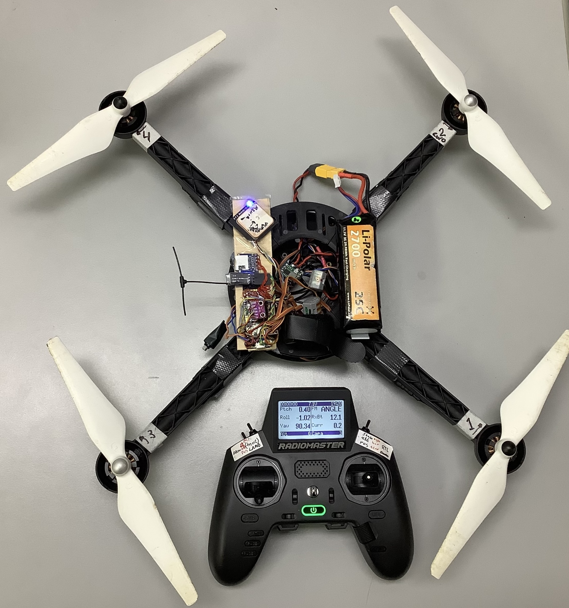

# Quadcopter Advanced

Advanced quadcopter demo program. Adds flight modes selectable by radio controller, telemetry, barometer, gps, and logging.

## Required Hardware

- IMU sensor (SPI or I2C)
- RC receiver with 6 channels (CRSF/ELRS preferred)
- 4 brushless motors with ESCs

## Connecting Hardware

- IMU: connect IMU_EXTI, IMU_CS, SPI_MISO, SPI_MOSI, SPI_CLK for SPI (or IMU_EXTI, I2C_SDA, I2C_SCL for I2C)
- RC receiver: connect RCIN_RX to receiver TX pin, and RCIN_TX to receiver RX pin.
- ESCs: PWM1-4 to the ESC inputs

Motor order diagram (Betaflight order)

```
      front
 CW -->   <-- CCW
     4     2 
      \ ^ /
       |X|
      / - \
     3     1 
CCW -->   <-- CW
```

Default flight mode is RATE. The mode can be changed to ANGLE with the flight mode channel of the radio controller. Important: calibrate the accelometer before using ANGLE.

## RATE Mode

The roll/pitch stick inputs control the rate of change. Keeping the sticks centered will keep turning at the current rate.

## ANGLE mode

The roll/pitch stick inputs control the roll/pitch angle. Keeping the sticks centered will keep the quadcopter horizontal.

## Arming / Disarming

- Arming: Set throttle low, then flip arm switch from DISARMED to ARMED.
- Disarming: Flip arm switch from ARMED to DISARMED, at any throttle position. "Kill switch".

## LED Status

- OFF - not powered
- ON - startup, running gyro calibration (don't move)
- blinking long OFF short ON - DISARMED
- blinking long ON short OFF - ARMED
- blink interval longer than 1 second - imu_loop() is taking too much time
- fast blinking - something is wrong, connect USB serial for info

## Building and Flying

Bill of Materials

Part|Price
|-|-|
Raspberry Pi Pico | $4.0
MPU6500 Gyro/Acc Module | $1.3
BME280 Barometer Module | $0.8
INA226 Current Sensor | $1.0
Mini DC-DC 12-20V To 5V 3A Buck Converter | $0.4
uBlox M8 GPS with QMC5883L Compass Compass Module | $10
ELRS receiver | $7.2
DJI E300 Propulsion System (9.4x4.3 props, 2212 920KV motors, 15A ESCs)

  
